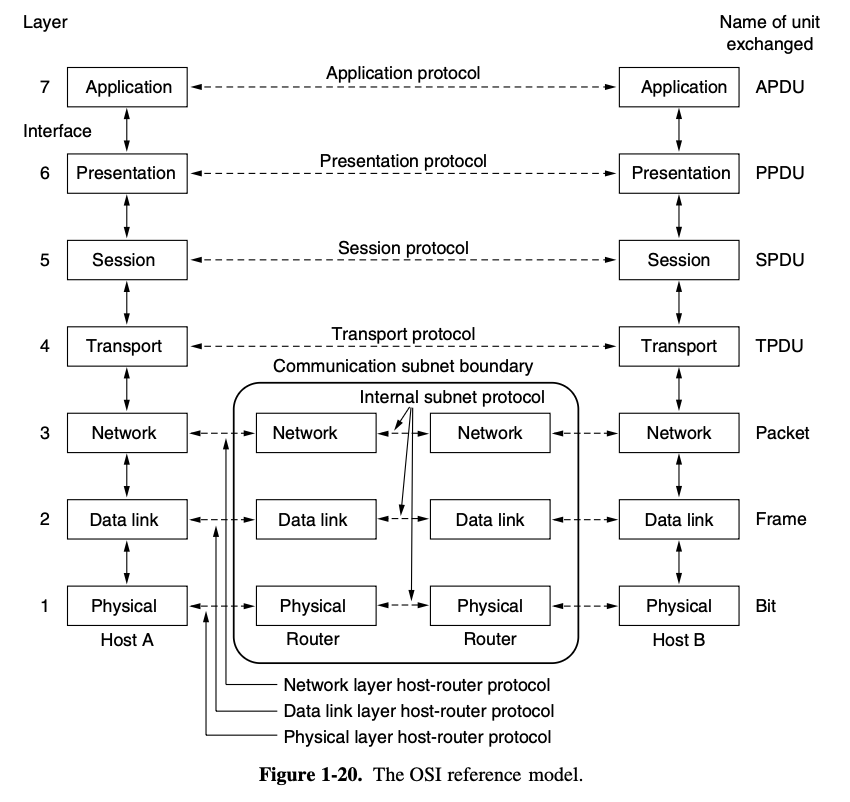

**Hop-by-Hop (Layers 1–3)**: Data changes at every router or switch  
**End-to-End (Layers 4–7)**: Data stays consistent from source to destination

### Layer 2 (Data Link): MAC Addresses

- **Switches** use MAC addresses to forward frames within the same local network (same subnet).
- **Routers** discard the old Layer 2 header and attach a new one for the next hop.
  > MAC addresses are updated at every router.

### Layer 3 (Network): IP Addresses and Routing

Routers operate in two key steps:

1. **Routing decision** – Determine the next hop using the destination IP.
2. **Frame rewrite** – Strip off the incoming Layer 2 header, attach a new one for the next link.

#### Router in the Middle (packet still in transit):

- Reads the **destination IP**, consults its routing table.
- **IP addresses (source and destination)** remain unchanged.
- Rewrites the Layer 2 frame and forwards the packet.
  > Frame is updated, but IP stays intact.

#### Destination Router (last hop before your device):

- Sees the destination IP matches its public-facing IP.
- Looks up its **NAT** table to find the internal (private) IP.
- Rewrites:
  - Destination IP: `203.0.113.1 → 192.168.1.100`
  - Destination port (if using PAT)
- Forwards to the actual device (phone, laptop, etc.)
  > This rewrite of an IP packet is exactly where the boundaries are broken.

### TL;DR

- **Layers 1–3**: Change at every hop — physical signals, MAC headers, and routing decisions.
- **Layers 4–7**: Stay consistent — the actual application-level data stream doesn’t change across the network.

---

### Takeaway

The OSI model was meant to have clean, layered separation — but NAT broke that. When routers rewrite destination IPs (Layer 3), the "end-to-end" nature of the stack gets blurred.

With **IPv6**, we can avoid NAT altogether and restore the original boundary between hop-by-hop and end-to-end behavior. The destination router won’t need to rewrite the IP — it can forward cleanly to the intended device.
